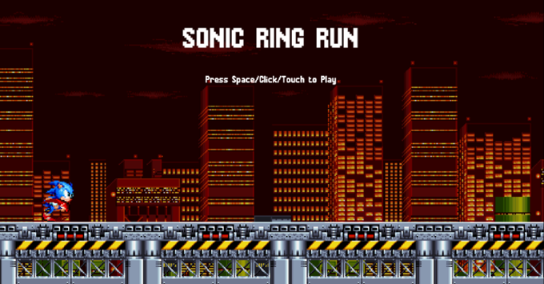

# Sonic Themed Infinite Runner Game

**Sonic Runner** is an endless-runner style 2D game built with **Kaplay (Kaboom.js)** and **JavaScript**, where you control Sonic to **jump over enemies**, **collect spinning rings**, and achieve the highest score possible as the game speed increases over time.

The game follows a complete gameplay flow:  
✅ **Disclaimer → Main Menu → Gameplay → Game Over** with scoring, ranks, sound effects, and replay support. 

---

## 🎮 Demo

### ✅ Gameplay

🔗 **Live Demo:** https://venerable-froyo-f37401.netlify.app/

---

## ✨ Features

### 🕹️ Core Gameplay
- ✅ Endless running gameplay with increasing difficulty
- ✅ Sonic animations: **Run + Jump**
- ✅ Jump controls supported on:
  - Keyboard
  - Mouse click
  - Mobile touch 

### 🪙 Ring Collection
- 🪙 Rings continuously spin using animation
- ✅ Collecting a ring increases score by **+1**
- UI feedback popup appears briefly (`+1`) 

### 👾 Enemy System (Motobug)
- 🤖 Motobugs spawn randomly with increasing speed
- ✅ If Sonic collides with an enemy on the ground → **Game Over**
- ✅ If Sonic jumps on an enemy mid-air → enemy gets destroyed + bonus score 

### 🔥 Score Multiplier System
- Chaining enemy kills in the air increases a multiplier:
  - First kill: `+10`
  - More kills: increases multiplier (`x2`, `x3`, ...)
- Multiplier resets when Sonic touches the ground 

### 🎥 Infinite Scrolling World
- ✅ Seamless infinite background scrolling system
- ✅ Infinite looping platforms to keep the runner continuous
- ✅ Background follows jump height slightly for a jump-effect feel 

### 🔊 Sounds & Music
Includes SFX + background ambience:
- 🎵 City background music loop
- 🔔 Ring collect sound
- 💥 Enemy destroy sound
- 😵 Hurt sound on collision
- ⭐ Jump sound 

### 🏆 Best Score + Rank System
- Tracks **current score**
- Stores **best score** using game storage
- Displays rank based on score:

---

## 🎮 Controls

| Input | Action |
|------|--------|
| **Space** | Jump |
| **Mouse Click (Left)** | Jump |
| **Touch (Mobile)** | Jump |

Controls work across **keyboard + mouse + mobile touch** using Kaplay button mapping. 

---

## 🗺️ Scenes & Flow

The game is structured into scenes for clean navigation and replay.

### ✅ Disclaimer Scene
- Shows a start message
- Press jump to enter **Main Menu** 

### ✅ Main Menu Scene
- Shows play instructions
- Animated background + moving platforms for menu ambience 

### ✅ Game Scene (Main Gameplay)
- Spawns rings + enemies endlessly
- Score updates dynamically
- Speed increases every second 

### ✅ Game Over Scene
Displays:
- Best Score
- Current Score
- Best Rank
- Current Rank  
Restart prompt to play again 

---

## 🧠 Game Mechanics 

### 🌀 Speed Progression
- Game begins with a base speed value
- Speed increases every second, making obstacles harder to dodge 

### 🪙 Scoring Rules
- Collecting rings: **+1**
- Destroying enemies while jumping:
  - **+10 × multiplier**
  - Multiplier increases with chained kills in the air
  - Multiplier resets when grounded 

### 💥 Enemy Collision Rules
- ✅ In-air collision → enemy destroyed + bounce jump + bonus score
- ❌ Ground collision → game over and score stored 

---

## 📁 Entities (Game Objects)

This project uses reusable entity creator functions:

### 🦔 Sonic 
- Runs by default
- Jumps only when grounded
- Shows small UI text above the player for ring/bonus feedback 

### 🪙 Ring 
- Spinning ring collectible
- Increases score and disappears on collision 

### 🤖 Motobug 
- Enemy mob that moves toward the player
- Gets destroyed when jumped on
- Triggers game over if collided while grounded 

---

## 🛠️ Tech Stack

- **Kaboom.js** 
- **JavaScript (ES Modules)**
- **Scene-based game architecture**
- **Sprite animations**
- **Audio system for SFX + music**

---

## How to run the project ?

Assuming you have `node` installed.
- Install dependencies with `npm install`
- Run locally with `npm run dev`
- Build for production with `npm run build` and a dist folder should appear
